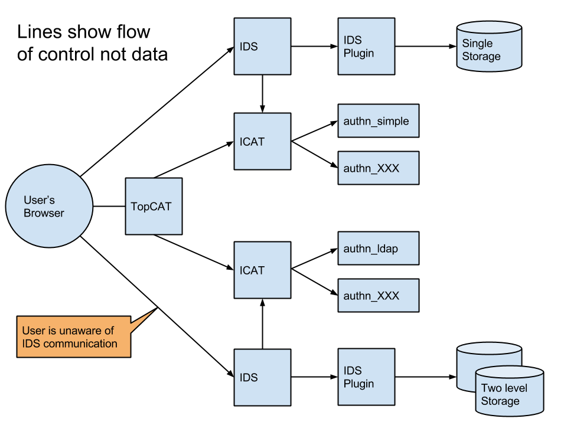

Each components of the ICAT project has its own GitHub repository within
an [icatproject organisation](https://github.com/icatproject) with the
code, a small Wiki and the Issue (bug/ feature request) List for that
component. If you simply want to install components then go to
[Installation](/installation/ "Installation").

- ICAT server and client : the metadata catalogue provides  a SOAP web
  service interface to the underlying database with an easy to use
  API. Authentication makes use of plugins and authorization is rule
  based. The icat-setup tool is provided for initial configuration of
  an ICAT for a facility and a simple editor, ice, is also available.
  Though ice is convenient as a web interface the
  [IcatManager](http://ftp.esrf.fr/pub/bliss/icatmanager/%20), which
  is a stand-alone application, provides similar functionality but is
  much more pleasant to use.
- IDS: the ICAT Data Service provides a uniform interface to data
  catalogued by ICAT. It exposes a RESTful web service and provides
  the ability to upload individual files and to download one or more
  files. When a file is uploaded the metadata are stored in ICAT. ICAT
  authorization rules for the "Datafile" ICAT are applied to control
  read/write access to the files in the IDS. If multiple files are
  requested they are packaged in zip format. The interface has some
  calls which assume two level storage (with all data available on a
  possibly slow system and recently used data on another) however it
  will work fine with only one level. The server makes use of a plugin
  mechanism so that a facility can choose its own directory structure
  for file storage. A two level file storage example plugin is
  provided as is an interface to which a plugin must conform if you
  choose to write your own.
- TopCAT: a web-based GUI able to search across multiple ICAT
  instances, to download data and soon it will be able to upload data
  as well. It makes use of both ICAT core and the IDS.
- IJP: the ICAT Job Portal to allow submission of jobs where data
  selection is based on ICAT information.  Both batch and interactive
  jobs are supported. It makes use of both ICAT core and the IDS. It
  is not currently shown on the diagram above.
- To see the structure of ICAT you can use the [ICAT
  Manager](/user-documentation/icat-manager/).
