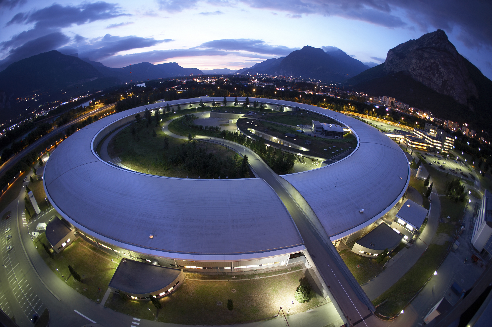

The ESRF - The European Synchrotron Radiation Facility - is the most intense source of synchrotron-generated light, producing X-rays 100 billion times brighter than the X-rays used in hospitals. These X-rays, endowed with exceptional properties, are produced at the ESRF by the high energy electrons that race around the storage ring, a circular tunnel measuring 844 metres in circumference.
Each year, the demand to use these X-ray beams increases and near to 9000 scientists from around the world come to Grenoble, to “beamlines”, each equipped with state-of-the-art instrumentation, operating 24 hours a day, seven days a week.

Thanks to the brilliance and quality of its X-rays, the ESRF functions like a "super-microscope" which "films" the position and motion of atoms in condensed and living matter, and reveals the structure of matter in all its beauty and complexity. It provides unrivalled opportunities for scientists in the exploration of materials and living matter in many fields: chemistry, material physics, archaeology and cultural heritage, structural biology and medical applications, environmental sciences, information science and nanotechnologies.

Thirty years ago the ESRF made history as the world’s first third-generation synchrotron light source. Today, the ESRF continues to lead the way with the Extremely Brilliant Source (EBS), a brand-new generation of high-energy synchrotron, improving X-ray performances of brilliance and coherence once again by a factor of 100. This new concept, based on innovative technology, paves the way for a new standard of synchrotrons around the world. ESRF-EBS will contribute to tackling global challenges in key areas such as health, environment, energy and new industrial materials, and to unveiling hidden secrets of our natural and cultural heritage through the non-destructive investigation of precious artifacts and palaeontological treasures.

Since 2014, ICAT has been deployed and most of the ESRF beamlines are today storing their data and metadata in ICAT. It has been proven to be a reliable and mature software that allows it to be used for all the experiments.

In addition to the use of ICAT as a metadata catalogue, new features like the electronic logbook or the sample tracking system have been developed as well as a dedicated front-end called E-Dataportal (https://data.esrf.fr).

The E-Dataportal is a modern front-end used at the ESRF and it is written in React. It uses a newly developed API called ICAT+ to retrieve data. In order to make it easier for users, the approach has been to put together in the same application all tools that the users will need when performing experiments at ESRF: sample tracking, metadata catalogue and electronic logbook.

ICAT+ is a set of RESTful webservices implemented in nodeJS. ICAT+ access to the metadata catalog data via ICAT API and has also access to a Mongo database where data of the logbook and the sample tracking are stored.  

The sample tracking system allows users to create, send and keep track of the samples that are sent to the facility including the safety aspects. Users can create addresses, shipments, parcels and describe the content of the parcel which will be validated by our safety team.

The electronic logbook allows to create both manual and automatic annotations on any experiment performed at the ESRF. Each investigation has its own logbook as well as any beamline. It is a powerful tool that allows users to capture the decision-making of an experiment. By default, the logbook is filled automatically with the command typed by the users during the experiment, then depending on the kind of experiment new inputs are accordingly sent to the logbook that will be stored and made public after the embargo period.

